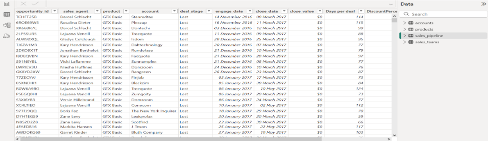
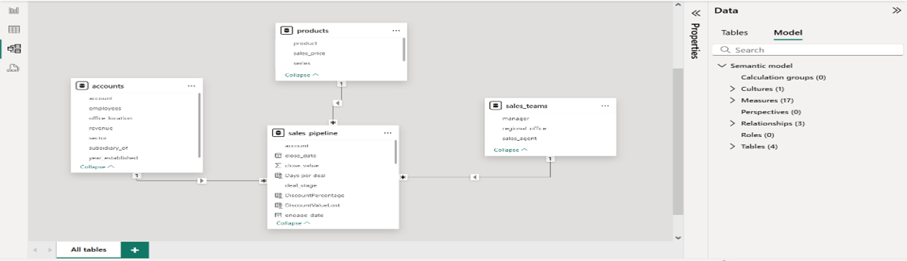
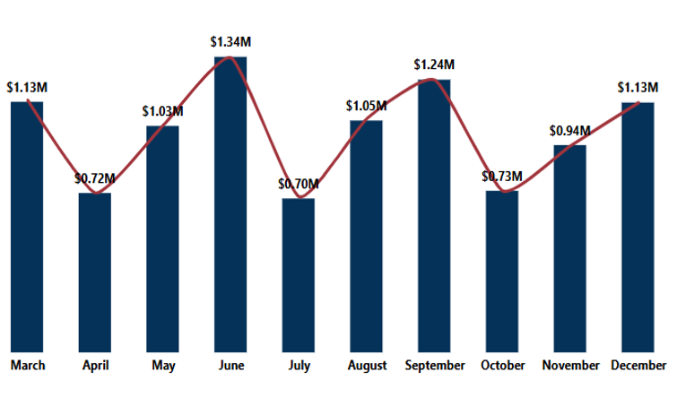
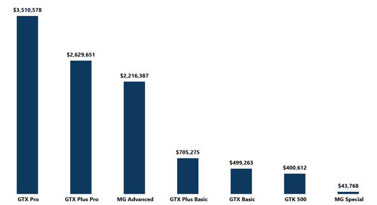
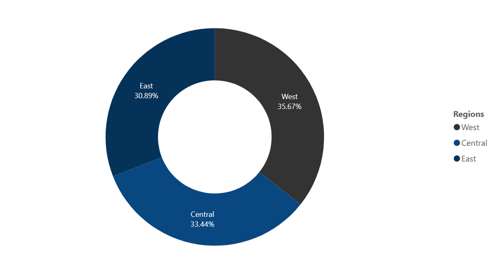
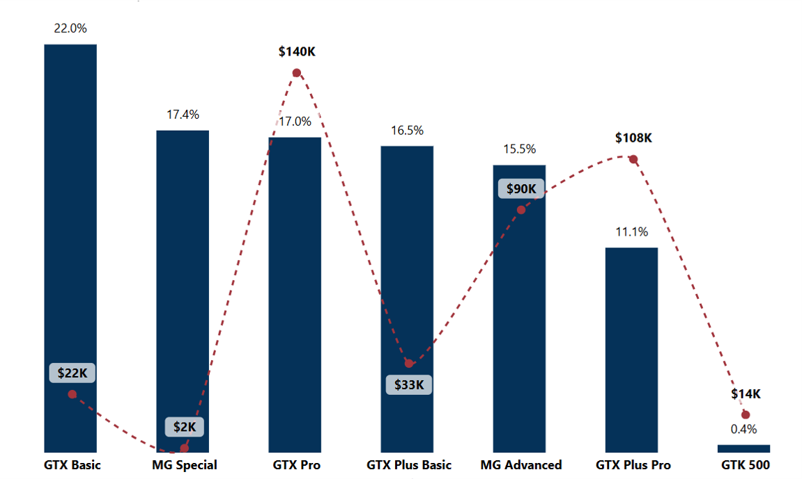
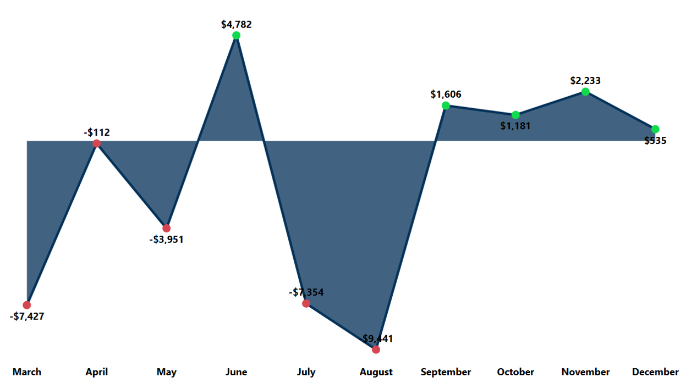
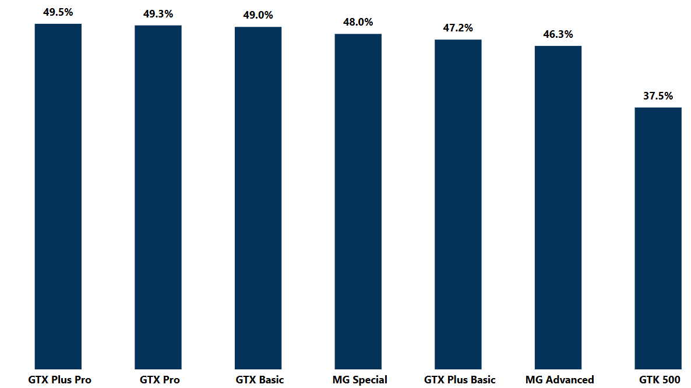
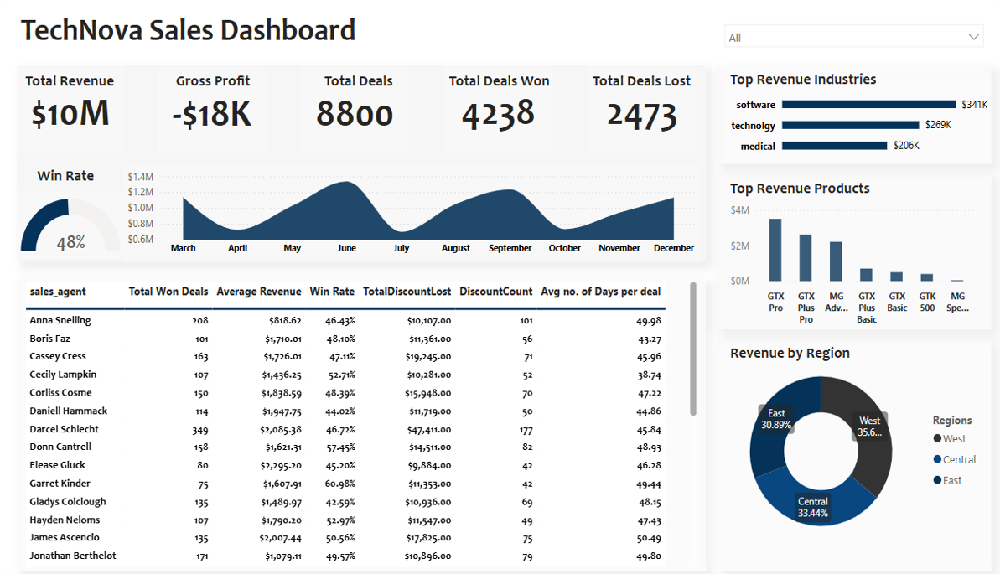

# B2B Sales Performance Analysis

### Introduction
This project is a PowerBi Data Analysis Project of a figurative store called **“TechNova Solutions”**, a B2B company that sells computer Hardware (Graphic Cards). 
This project aims to provide insights into the sales and employee performance of the first 10 months of business. By analysing the dataset we seek to identify trends, make data-driven recommendations and gain a deeper understanding of the company's sales performance.

### Table of Contents
- [Project Overview](#project-overview)
- [Objective](#objective)
- [About Dataset](#about-dataset)
- [Problem Statement](#problem-statement)
- [Data Analysis Technique](#data-analysis-technique)
- [Data Analysis](#data-analysis)
- [Results and Findings](#results-and-findings)
- [Recommendations](#recommendations)
- [Conclusion](#conclusion)


### Project Overview


TechNova is a start-up Tech company that sells computer graphic cards to other businesses. After the first 10 months, the company is looking to increase revenue, optimize operations, and improve sales efficiency. This project analyzes sales performance, focusing on **sales team efficiency, product win rates, and revenue trends.**

 ### Objective
- Compare sales team performance across different regions.
- Identify underperforming sales agents to improve efficiency.
- Analyze month-over-month (MoM) trends to spot patterns.
- Determine product win rates to understand which products sell best.
- Evaluate the impact of discounts on revenue and profitability

### About Dataset:

The dataset was obtained from the [Maven Analytics page](https://mavenanalytics.io/data-playground?order=date_added%2Cdesc&page=3&pageSize=5).

Screenshots of Dataset:
| Database       | Data Model     | 
| :-------------: |:-------------:| 
|       |  |


The dataset contained multiple tables:
- *accounts*
- *sales_pipeline*
-  *sales_team*
- *products*;
containing about **8430** records, **31** fields.

> ***Disclaimer:*** All datasets and reports do not represent any company, institution or country, the datasets are from the **Maven CRM Sales Opportunities** which can be accessed [here](https://maven-datasets.s3.amazonaws.com/CRM+Sales+Opportunities/CRM+Sales+Opportunities.zip). 

Problem Statement 
------
From recent reports, TechNova have been experiencing fluctuations in revenue, inconsistencies in sales team performance, and high discounts impacting profitability. 
Some of the key questions to get insights are:

- What is the total revenue across the 10 months of business?
- How does Sales Perfomance contribute to the Total Revenue Fluctuation?
- what is the Gross Profit?
- What is the gross profit across the 10 months?
- Which product brings in more revenue?
- which products have better win rates?
- what are the impacts of discount on Revenue and Profitability?

Data Analysis Technique
-----
**PowerBi** was used for the whole analytical process which involved: 

 Data Modeling: created relationships between the four tables (named *accounts*, *sales_pipeline*, *sales_team*, & *products*) found in the dataset.
 
 Data Cleaning: **Power Query** (embedded in PowerBi) Was used for cleaning the dataset.
 
 Data Manipulation: Power Query and **DAX calculations** were used for managing the dataset
 
 Data Visualisation: Creating an interactive Dashboard


Data Analysis
----
Key Measures were calculated using the DAX calculations to help in the analysis of the dataset:

1. Total Revenue
   ```DAX
   Total revenue = CALCULATE(SUM(sales_pipeline[close_value]), sales_pipeline[deal_stage] = "Won")
   ```
2. Total Deals Won
   ```DAX
   Total Won Deals = CALCULATE(COUNT(sales_pipeline[opportunity_id]), sales_pipeline[deal_stage] = "Won")
   ```
3. Average Time Taken to win a Deal
   ```DAX
   Average Time taken to Close a Deal (Days) = AVERAGEX(
    FILTER(sales_pipeline, sales_pipeline[deal_stage] = "Won"),
    DATEDIFF(sales_pipeline[engage_date], sales_pipeline[close_date], DAY))
   ```
4. Number of Products Discounted
   ```DAX
   Number of Discounted Products = SUMX(
    FILTER(sales_pipeline, sales_pipeline[close_value] < RELATED(products[sales_price])),
    [Total Won Deals])
   ```
5. Win Rate
```DAX
Win Rate = DIVIDE([Total Won Deals], [Total Deals], 0)
```
6. Total Discount Amount lost
```DAX Calculation
TotalDiscountLost = 
SUMX(
    FILTER(
        sales_pipeline, 
        sales_pipeline[close_value] < RELATED(products[sales_price]) && sales_pipeline[close_value] > 0
    ), 
    RELATED(products[sales_price]) - sales_pipeline[close_value]
)
```


### Results and Findings

1. **Total Revenue**:
   
   **June** has the most Revenue generated with about **$1.3M**, followed by **September** with **$1.2M** while
   **April** and **July** had the least revenue generated with just about **$700k**

   Check Image below:
   
   

2. **Products with the most Revenue**:
   
   **GTX Pro** grossed the most revenue with about ***$3.5M***, followed by the **GTX Plus Pro**. **MG Special** had the least revenue with just above ***$40k*** followed
   by the **GTK 500**.

   Check Image below:
   
   

3. **Total Revenue by Region**:
   
   The Western region made about $3.6m, followed by the Central region with $3.3m, the Eastern had the lowest revenue of about $3.1m

   Check Image below:
   

4. **Discounts**:
   
   **GTX Basic** had the highest percentage of discounted sales with **22%** and a total of about **$22,000** lost to discounted sales.
   While the **GTX Pro** incurred the ***highest loss*** due to discounts, totaling approximately **$140,000**, despite being the third-highest product in discounted sales.
   It was followed by **GTX Plus Pro**, which recorded a discount loss of **$108,000**

   Due to increased Discounts given to clients by the sales team, TechNova **lost over $400,000** in revenue to discounted sales across the first 10 months of business

   Check Image below:
   
   

   
5. **Gross Profit**:
   
   TechNova incurred a Deficit of about **$18,000** in Gross profit. Gross profit shows the difference between the total cost price of products sold and the total sales.
   Gross profit loss across the 10 months with **June** having the highest gross profit with about **$4,800**, followed by November with **$2,233**. 
   December generated a mere $535 while August had the **highest loss** incurred with over **$9,400**, followed by March & July with over **$7,300**.

   Check Image below:
   
     

6. **Win Rate**:
   
   With a total of 8800 deals, 4238 were WON deals, giving a win rate of **48.2%**.
   With the GTX Pro having the highest win rate of 49.5%, while **GTK 500** had the lowest win rate of 37.5%

   Check Image below:
   
     
   


-----
## Dashboard

Below is a Screenshot of the PowerBi Dashboard Created for this Project:

   

Access to the dashboard can be found [here](https://app.powerbi.com/groups/me/reports/09e5b635-a5a8-492b-9a0c-bc5c69f9d65c/e5cd850855c23f6f6dd7?experience=power-bi)

-----


Recommendations
-----

1. **Reduce Unecessary Discounting**:
   - Implement stricter discount approval processes to minimize revenue loss from excessive discounting and ensure that discounts are strategically aligned with business         objectives.

3. **Pricing Review**:
   - With 50% of products being sold at a discounted rate, it shows that the market price is not favorable to the customers. 
     This might involve optimizing the value chain to reduce costs of getting these products before sales and subsequently giving room for increased profit per sale of a         product.

5. **Provide Additional Training to Sales Agents**:
   - Offer targeted training programs to underperforming sales agents, focusing on key skills such as negotiation, closing techniques, and product knowledge. This will help      improve their overall performance.

7. **Sales Incentive Programs**:
   - Introduce a quarterly sales incentive program for top closers, rewarding them for their outstanding performance and motivating others to strive for excellence. This         will drive increased sales and revenue.

9. **Mentorship Opportunities**:
    - Create mentorship opportunities where top-performing sales agents can guide and support their peers. This will foster a collaborative environment and facilitate             knowledge sharing.

-----
### Conclusion 

The analysis of the data for the 10 months has provided valuable insights into TechNova sales pipeline. The undulating revenue and loss in gross profit highlight areas of weakness for the business.

Thus, opportunities for improvement remain, such as removing unnecessary discounts, reviewing the prices of products, and leveraging on trainings and incentives for the sales agents to enhance better price negotiation with clients. By implementing the recommended strategies, TechNova can capitalize on its strengths, address operational inefficiencies, and foster sustainable growth, ensuring a consistently progressive growth experience as they move past the first one-year of the business.


 
